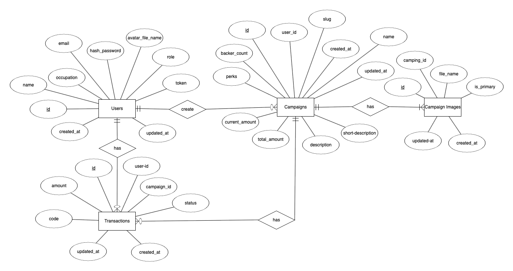

# Campaign-Backend

## Sebagai aplikasi penggalangan dana dari berbagai projek

## ERD campaign

## Sebelum menjalankan aplikasi

- Buat file `.env`
- Isi file dengan key `SECRET_KEY` `DSN_SECRET` `SERVER_KEY`
- `SECRET_KEY` sebagai signature pada JWT
- `DSN_SECRET` membuat koneksi ke database mysql
- `SERVER_KEY` diambil dari akun masing-masing midtrans

## List API endpoints

- POST http://localhost:8080/api/v1/users (register)
- POST http://localhost:8080/api/v1/users (login)
- POST http://localhost:8080/api/v1/email_checkers (checked email user)
- POST http://localhost:8080/api/v1/avatars (upload avatar)
- POST http://localhost:8080/api/v1/campaigns (create campaign)
- PUT http://localhost:8080/api/v1/campaigns/{campaign_id} (update campaign)
- GET http://localhost:8080/api/v1/campaigns (list campaigns)
- GET http://localhost:8080/api/v1/campaigns/{campaign_id} (detail campaign)
- GET http://localhost:8080/api/v1/campaigns/{campaign_id}/transactions (campaign's transaction)
- POST http://localhost:8080/api/v1/campaign-images (upload campaign images)
- POST http://localhost:8080/api/v1/transactions (create transaction)
- GET http://localhost:8080/api/v1/transactions?user_id={} (list transaction's user)
- POST http://localhost:8080/api/v1/transactions/notification (transaction notification)
